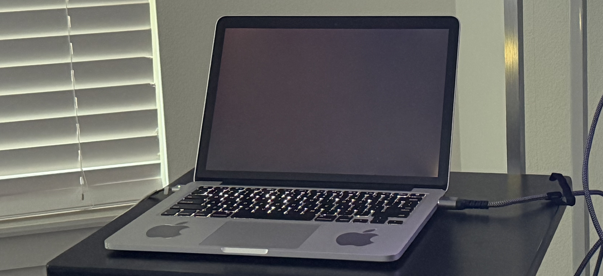
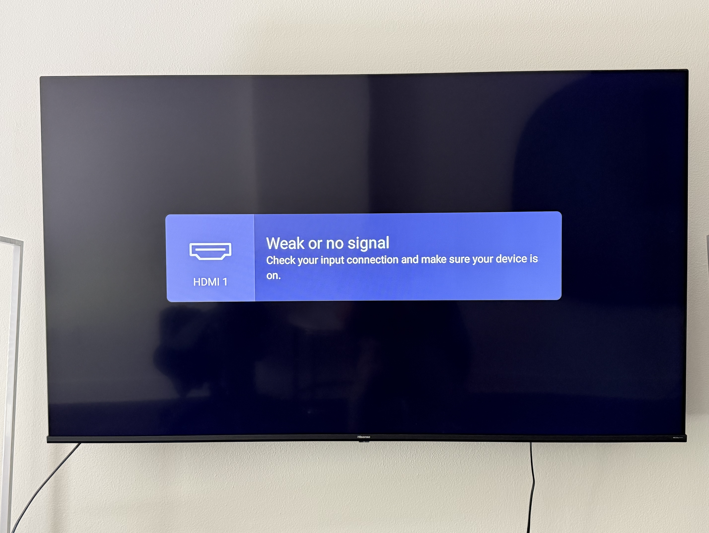
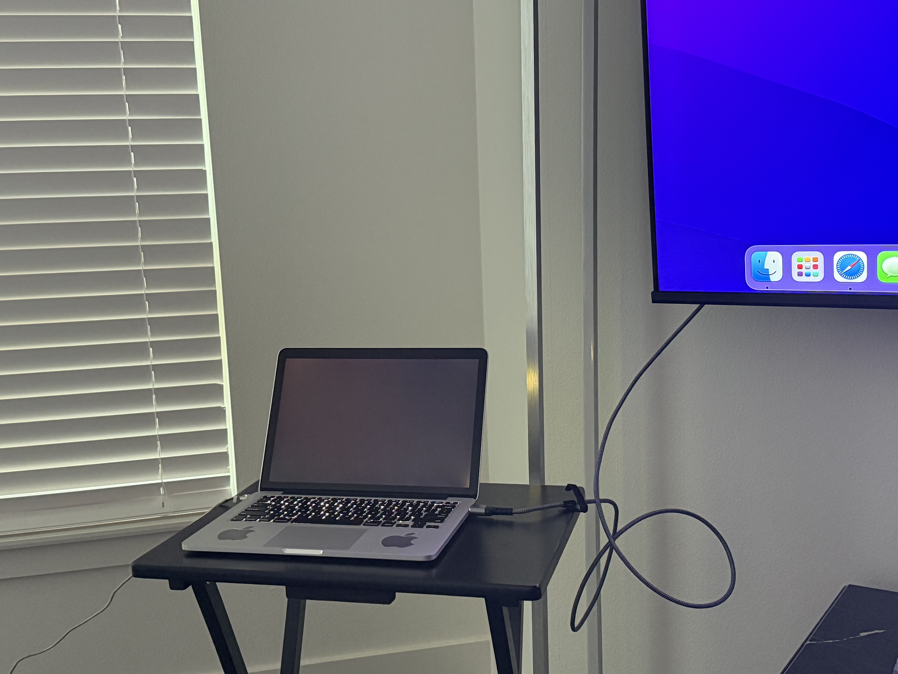
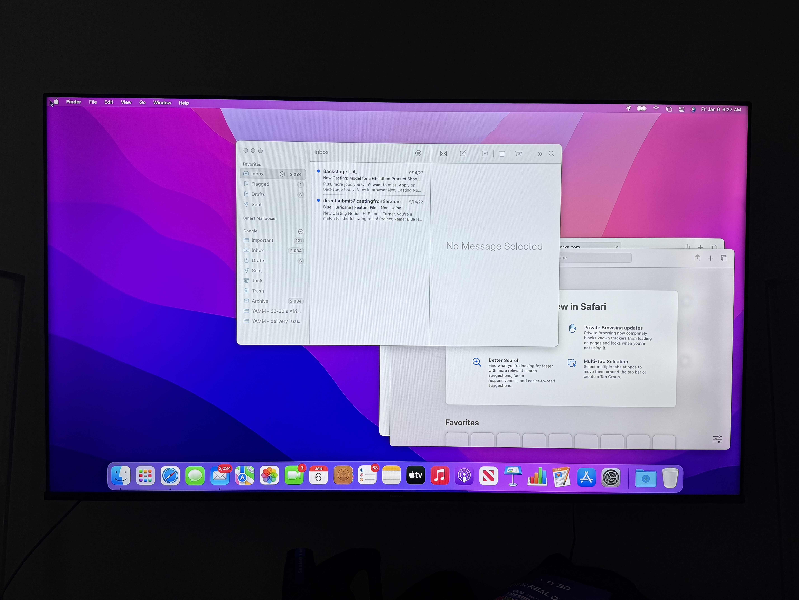
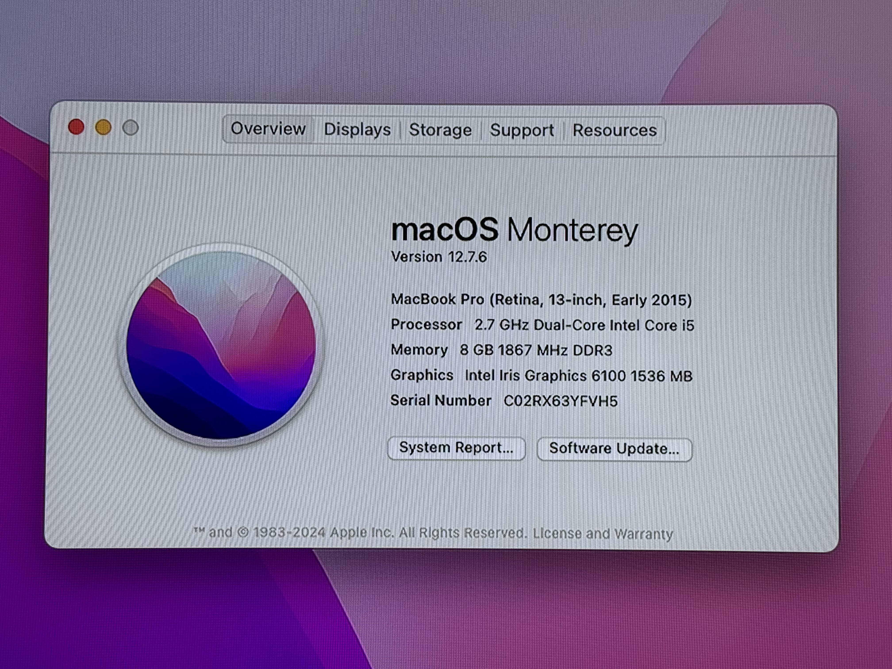
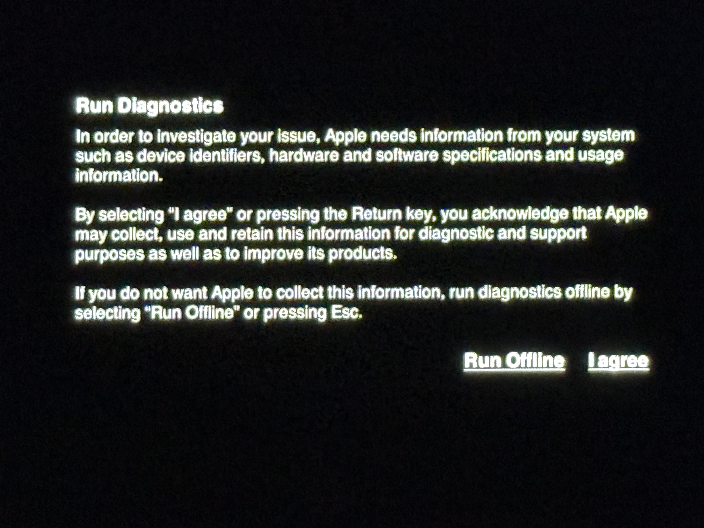
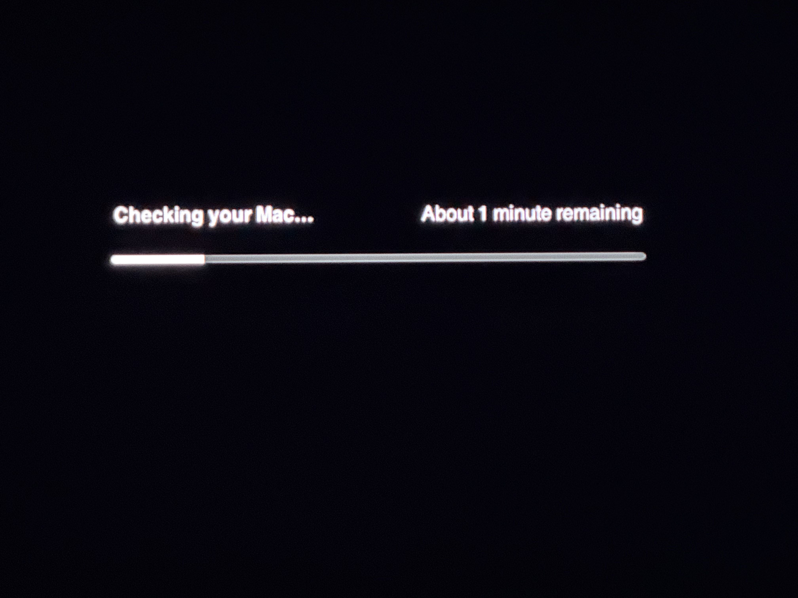
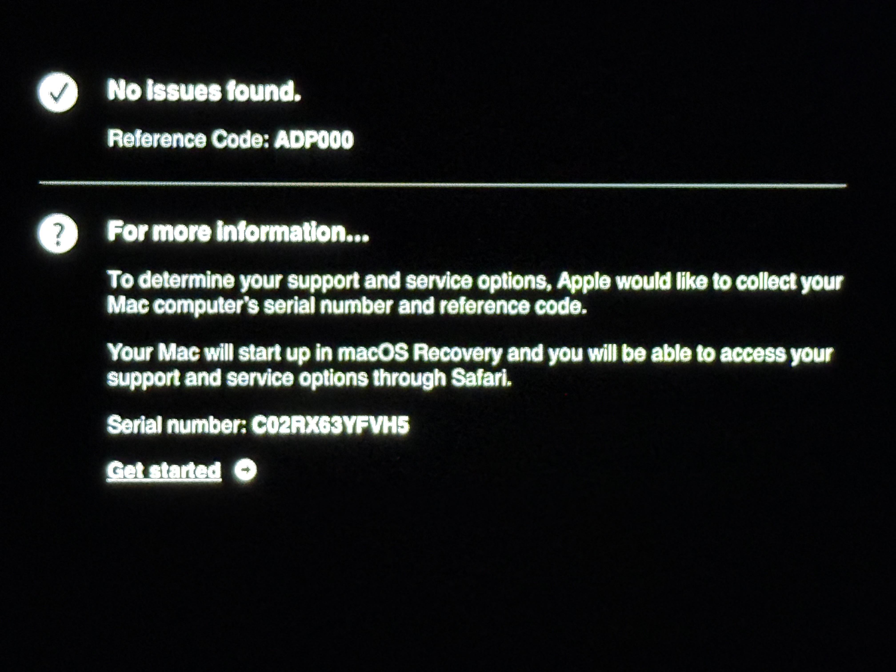

# Mac Hardware Troubleshooting & Display Diagnostics Lab

## Overview

This project documents a real-world hardware diagnostic investigation performed on a **MacBook Pro (Retina, 13-inch, Early 2015)** presenting with a complete black screen on boot. Using a systematic troubleshooting methodology, I identified the root cause, confirmed core hardware integrity, and isolated the fault to the internal display — mirroring the triage process used in professional IT support environments.

-----

## Device Specifications

|Property         |Details                                  |
|-----------------|-----------------------------------------|
|**Model**        |MacBook Pro (Retina, 13-inch, Early 2015)|
|**OS**           |macOS Monterey 12.7.6                    |
|**Processor**    |2.7 GHz Dual-Core Intel Core i5          |
|**Memory**       |8 GB 1867 MHz DDR3                       |
|**Graphics**     |Intel Iris Graphics 6100 — 1536 MB       |
|**Serial Number**|C02RX63YFVH5                             |

-----

## Problem Statement

The MacBook powered on — keyboard backlight illuminated and the system appeared to be running — but the internal display remained completely black. No Apple logo, no login screen, and no visible output of any kind on the built-in screen.

**Goal:** Determine whether the fault was caused by a software issue, core hardware failure, or an isolated display hardware problem.

-----

## Tools & Technologies Used

- macOS Monterey
- Apple Diagnostics (built-in hardware test utility)
- External display via HDMI (Hisense 65” 4K TV)
- Mini DisplayPort to HDMI adapter
- SMC Reset (System Management Controller)
- NVRAM Reset (Non-Volatile RAM)

-----

## Troubleshooting Methodology

### Step 1 — Document the Symptom

Observed and photographed the MacBook powered on with a completely black internal display. Keyboard backlight confirmed the system was receiving power and attempting to boot.

-----

### Step 2 — Attempt SMC Reset

The **System Management Controller (SMC)** manages low-level hardware functions including display output and power management. Resetting it can resolve black screen issues caused by firmware glitches.

**Procedure:**

- Shut down the MacBook completely
- Held **Shift + Control + Option + Power** simultaneously for 10 seconds
- Released all keys and powered the MacBook back on

**Result:** No change. Internal display remained black.

-----

### Step 3 — Attempt NVRAM Reset

**NVRAM** stores system settings including display configuration and resolution preferences. A corrupted NVRAM entry can sometimes cause display output failures.

**Procedure:**

- Powered off the MacBook
- Held **Command + Option + P + R** immediately after pressing the power button
- Held the keys for approximately 20 seconds until the startup chime sounded twice

**Result:** No change. Internal display remained black.

-----

### Step 4 — External Display Test (HDMI 1)

Connected the MacBook to an external display via Mini DisplayPort to HDMI adapter to determine whether the system was outputting video at all.

**Initial result:** TV displayed **“Weak or no signal”** on HDMI 1 — no video output detected.

-----

### Step 5 — External Display Test (HDMI 2 — Reseated Connection)

Switched the HDMI cable to **HDMI 2** on the TV and reseated the adapter connection on the MacBook.

**Result:** macOS login screen appeared on the external display — system confirmed fully operational.

**Significance:** This confirmed the MacBook’s logic board, GPU, and operating system were all functioning correctly. The fault was isolated to the internal display hardware.

-----

### Step 6 — System Verification

After logging in, verified full system functionality by navigating macOS, opening applications, and confirming normal operation.

Checked **About This Mac** to document exact device specifications.

-----

### Step 7 — Apple Diagnostics

Ran **Apple Diagnostics** to perform a comprehensive hardware test of all core system components including the logic board, memory, storage, and GPU.

**Procedure:**

- Shut down the MacBook
- Held the **D key** while pressing the power button
- Selected language and agreed to diagnostic terms
- Allowed the diagnostic to complete (~3 minutes)

**Result:** ✅ **No issues found. Reference Code: ADP000**

**Significance:** ADP000 confirms all tested hardware components passed. The black screen fault is definitively isolated to the internal display panel or display flex cable — not the logic board, GPU, RAM, or storage.

-----

## Root Cause Analysis

|Component            |Status                                   |
|---------------------|-----------------------------------------|
|Logic Board          |✅ Passed                                 |
|GPU / Graphics       |✅ Passed                                 |
|RAM                  |✅ Passed                                 |
|Storage              |✅ Passed                                 |
|External Video Output|✅ Functional                             |
|Internal Display     |❌ Black screen — hardware fault confirmed|

**Conclusion:** The MacBook Pro has a hardware fault isolated to the internal display assembly. The most likely cause is a failed or damaged **display flex cable** — a known issue on Early 2015 MacBook Pro models that can be repaired by replacing the display cable, a low-cost repair documented on iFixit.

-----

## Key Takeaways

- Applied a structured, layered diagnostic approach — ruling out software causes before escalating to hardware investigation
- Used external display testing to isolate the fault to a specific subsystem without disassembling the device
- Leveraged Apple’s built-in diagnostic utility to confirm hardware integrity and generate a reference code for documentation
- Documented all steps, results, and findings in a format consistent with professional IT ticketing and hardware triage workflows

-----

## Potential Next Steps

- Source replacement display flex cable for MacBook Pro Early 2015 (estimated cost: $5–$20)
- Follow iFixit repair guide for display cable replacement
- Verify internal display functionality post-repair
- Update documentation with repair outcome

-----

## Project Media

📹 [Watch the full troubleshooting walkthrough](#) *(YouTube link — coming soon)*

-----

## Connect

**Samuel K. Turner**
[LinkedIn](https://linkedin.com/in/samuelkturner) | [GitHub](https://github.com/samuelkturner)
